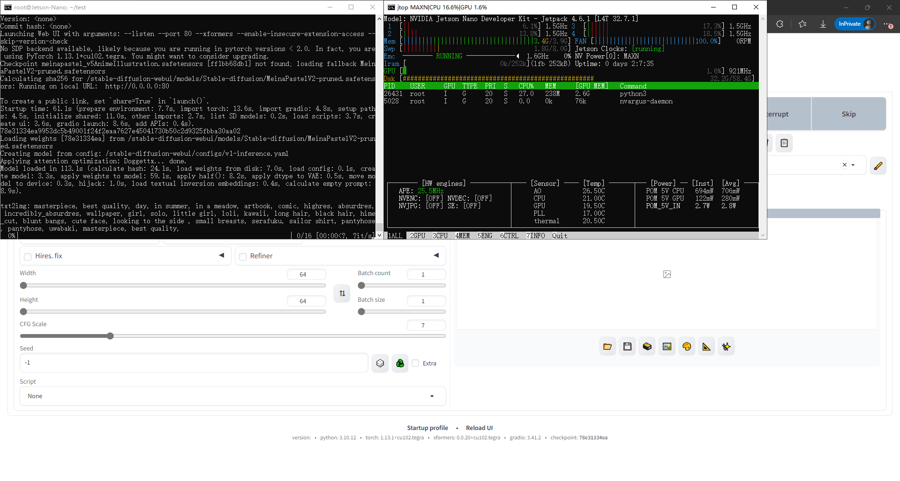

### Build stable-diffusion-webui container for Jetson platform



container environments:
jetpack5.1.2(ubuntu20.04), cuda11.4.19, python3.10, pytorch2.1.2, compiled for sm_72(Xavier) and sm_87(Orin)

pull and run built container:
```
docker run -it --rm --runtime=nvidia -p 80:80 -v /path/to/MODELS:/stable-diffusion-webui/models/Stable-diffusion docker.841973620.net:8888/build/stable-diffusion:cuda11.4-tegra-base
```

pull and run built container for meinapastel 5:
```
docker run -it --rm --runtime=nvidia -p 80:80 docker.841973620.net:8888/build/stable-diffusion:cuda11.4-tegra-meinapastel5
```
